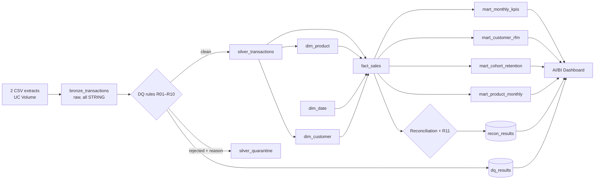

# Retail Lakehouse & Data Quality Pipeline

End-to-end analytics pipeline on **Databricks** (Unity Catalog, Delta Lake, Spark SQL) using ~1M real e-commerce transactions from the UCI *Online Retail II* dataset. It takes messy spreadsheet extracts through a **medallion architecture** (bronze → silver → gold), enforces **11 data quality rules** with a quarantine table and run logs, models the result as a **star schema**, and serves KPI marts to a dashboard.

> **Status:** pipeline code and documentation complete; first-run results and dashboard screenshots will be added after the initial run on Databricks.

The focus is the part of analytics work that happens before the chart: turning business questions into KPI definitions, making the data trustworthy, and proving the numbers reconcile.

## Architecture



| Layer | What happens |
|---|---|
| **Bronze** | Raw CSVs loaded unchanged with `read_files`, plus lineage (`source_file`, `ingested_at`) |
| **Silver** | Type casting, invoice classification (sale / cancellation / adjustment), de-duplication, blocking DQ rules → clean table or quarantine; Delta CHECK constraints |
| **Gold** | Star schema (`fact_sales` + 3 dimensions) with primary/foreign keys; KPI marts for revenue, RFM segmentation, cohort retention, product performance |
| **Governance** | Rule catalogue, run-level DQ and reconciliation logs, table/column comments, Unity Catalog tags, pipeline gate that fails the run on any reconciliation break |

## Data quality highlights
- **11 rules** (`dq_rules`), each with severity and action: removed / flagged / quarantined / monitored.
- **Nothing is dropped silently:** every rejected row lands in `silver_quarantine` with its rule.
- **Reconciliation:** bronze rows = silver + quarantine + removed duplicates; revenue matches silver → fact → mart to the penny; zero orphan keys.
- **Gate:** `assert_true` in notebook 04 stops a scheduled job before bad numbers reach the dashboard.

<!-- Fill in after the first run -->
| Metric (first run) | Value |
|---|---|
| Bronze rows | _tbd_ |
| Exact duplicates removed (R01) | _tbd_ |
| Lines without customer ID (R02) | _tbd_ |
| Rows quarantined (R04/R05/R07/R10) | _tbd_ |
| Reconciliation checks passed | _tbd_ / 5 |

## Business questions answered
See [`docs/requirements.md`](docs/requirements.md) for stakeholders, KPI definitions and acceptance criteria, and [`docs/data_dictionary.md`](docs/data_dictionary.md) for every table and column.

## How to run
1. Download *Online Retail II* from the UCI Machine Learning Repository (dataset 502) and put `online_retail_II.xlsx` in `data/`.
2. `python3 scripts/convert_to_csv.py data/online_retail_II.xlsx` → two CSVs in `data/`.
3. In a Databricks workspace (Free Edition works), import the `notebooks/` folder.
4. Run `00_setup`, upload both CSVs to *Catalog → workspace → retail → raw*.
5. Run `01_bronze` → `02_silver` → `03_gold` → `04_dq_reconciliation` (or chain them as a Job).
6. Build the dashboard from the datasets in `05_dashboard_queries`.

## Repo layout
```
notebooks/   Databricks SQL notebooks (00–05)
docs/        requirements.md, data_dictionary.md
scripts/     convert_to_csv.py
data/        raw files (not committed)
```

## Data source
Chen, D. (2012). *Online Retail II* [Dataset]. UCI Machine Learning Repository. https://doi.org/10.24432/C5CG6D — CC BY 4.0.
