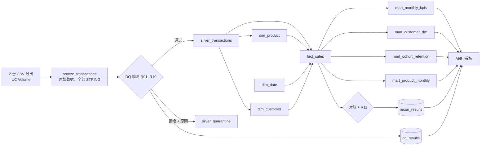

# 零售 Lakehouse 与数据质量流水线

[English](README.md) | **中文**

基于 **Databricks**（Unity Catalog、Delta Lake、Spark SQL）的端到端分析流水线，使用 UCI *Online Retail II* 数据集中约 100 万条真实电商交易记录。项目把杂乱的表格导出数据依次经过 **奖章架构**（bronze → silver → gold）处理，用隔离表和运行日志落实 **11 条数据质量规则**，将结果建模为 **星型模型**，并通过 KPI 数据集市为看板提供数据。

> **状态：** 流水线已在 Databricks Free Edition 上端到端跑通，全部对账检查通过；看板截图即将补充。

项目关注的是画图之前的那部分分析工作：把业务问题转化为 KPI 定义，让数据可信，并证明各层数字能够对平。

## 架构



| 层 | 做了什么 |
|---|---|
| **Bronze** | 用 `read_files` 原样加载 CSV，并附加血缘字段（`source_file`、`ingested_at`） |
| **Silver** | 类型转换、发票分类（销售 / 取消 / 调整）、去重、阻断型 DQ 规则 → 进入干净表或隔离表；Delta CHECK 约束 |
| **Gold** | 星型模型（`fact_sales` + 3 个维度表），带主键 / 外键；收入、RFM 分群、同期群留存、商品表现等 KPI 集市 |
| **治理** | 规则目录、按运行记录的 DQ 与对账日志、表 / 列注释、Unity Catalog 标签，以及在任何对账不一致时让运行失败的流水线闸门 |

## 数据质量亮点
- **11 条规则**（`dq_rules`），每条都有严重级别和处理方式：删除 / 标记 / 隔离 / 监控。
- **不静默丢弃任何数据：** 每一条被拒绝的行都会连同触发的规则进入 `silver_quarantine`。
- **对账：** bronze 行数 = silver + 隔离 + 已删除的重复行；silver → fact → mart 的收入精确到分；孤立键为零。
- **闸门：** notebook 04 中的 `assert_true` 会在错误数字进入看板之前中止定时作业。

| 指标（首次运行） | 值 |
|---|---|
| Bronze 行数 | 1,067,371 |
| 删除的完全重复行（R01） | 34,335 |
| 缺少客户 ID 的行（R02） | 229,200 |
| 隔离行数（R04/R05/R07/R10） | 6,021 |
| 通过的对账检查 | 5 / 5 |

## 回答的业务问题
干系人、KPI 定义和验收标准见 [`docs/requirements.md`](docs/requirements.md)，每张表、每一列的说明见 [`docs/data_dictionary.md`](docs/data_dictionary.md)（文档为英文）。

## 如何运行
1. 从 UCI 机器学习库（数据集 502）下载 *Online Retail II*，把 `online_retail_II.xlsx` 放到 `data/`。
2. 运行 `python3 scripts/convert_to_csv.py data/online_retail_II.xlsx`（需要 `pandas` 和 `openpyxl`）→ 在 `data/` 中生成两份 CSV。
3. 在 Databricks 工作区（Free Edition 即可）中导入 `notebooks/` 文件夹。
4. 运行 `00_setup`，把两份 CSV 上传到 *Catalog → workspace → retail → raw*。
5. 依次运行 `01_bronze` → `02_silver` → `03_gold` → `04_dq_reconciliation`（或串成一个 Job）。
6. 用 `05_dashboard_queries` 中的数据集搭建看板。

## 仓库结构
```
notebooks/   Databricks SQL notebooks（00–05）
docs/        requirements.md、data_dictionary.md
scripts/     convert_to_csv.py
data/        原始文件（不提交）
```

## 数据来源
Chen, D. (2012). *Online Retail II* [Dataset]. UCI Machine Learning Repository. https://doi.org/10.24432/C5CG6D — CC BY 4.0.
